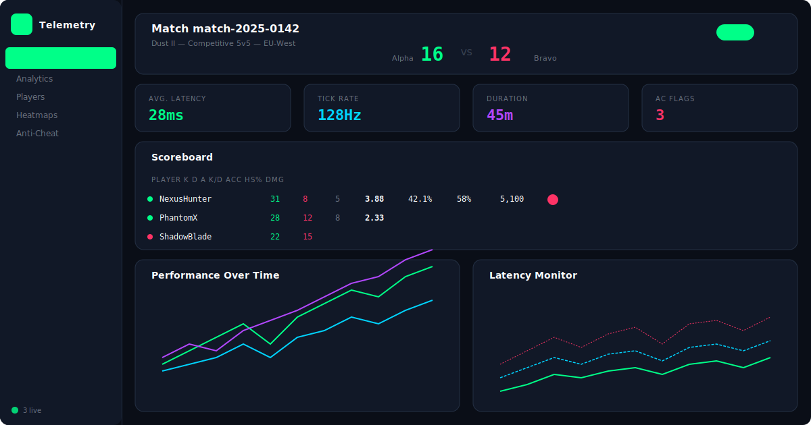
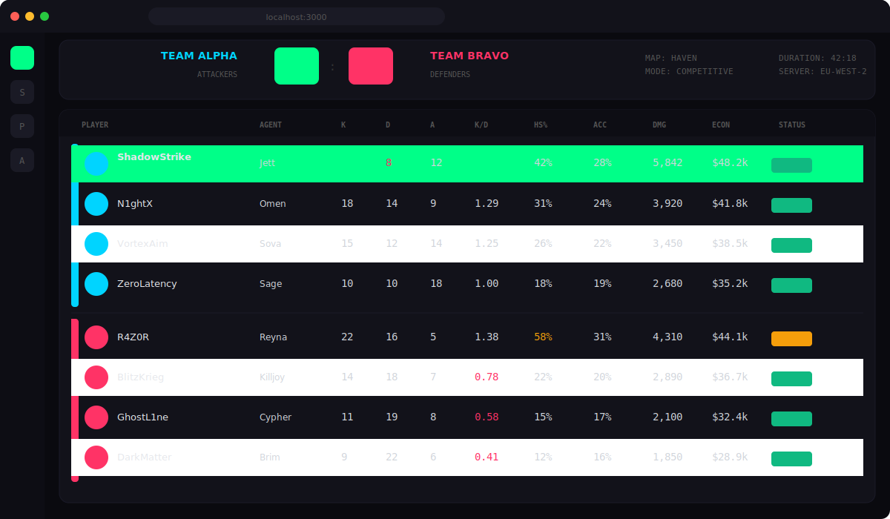
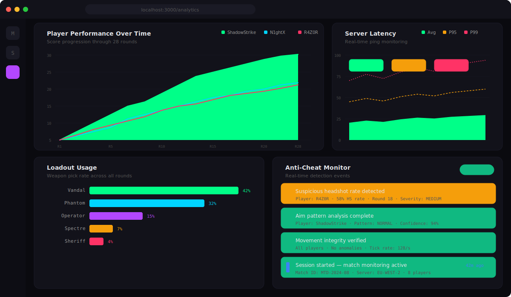

# Match Telemetry Dashboard

Real-time game match analytics dashboard for competitive FPS titles. Built with Next.js 14 and TypeScript.



### Scoreboard


### Analytics


## Features

- **Match Session Viewer** — Full match overview with team scores, map info, and server details
- **Player Scoreboard** — K/D/A, accuracy, headshot %, damage dealt with team indicators
- **Performance Charts** — Real-time score progression per player over match duration
- **Latency Monitor** — Avg/P95/P99 latency tracking with packet loss indicators
- **Loadout Analytics** — Weapon usage rates, win rates, and category breakdowns
- **Anti-Cheat Panel** — Flagged events with confidence scores and severity levels
- **Match Timeline** — Chronological event feed (kills, objectives, rounds, AC flags)
- **Dark Gaming UI** — Neon-accented dark theme designed for esports analytics
- **Export** — Match data export in JSON/CSV format

## Tech Stack

- **Framework:** Next.js 14 (App Router)
- **Language:** TypeScript
- **Styling:** Tailwind CSS (custom gaming theme)
- **Charts:** Recharts
- **Animations:** Framer Motion

## Getting Started

```bash
git clone https://github.com/idirdev/match-telemetry-dashboard.git
cd match-telemetry-dashboard
npm install
npm run dev
```

## Project Structure

```
src/
├── app/
│   ├── page.tsx              # Main dashboard
│   ├── layout.tsx            # Root layout
│   └── globals.css           # Global styles
├── components/
│   ├── sidebar.tsx           # Navigation sidebar
│   ├── match-header.tsx      # Match info header
│   ├── scoreboard.tsx        # Player scoreboard
│   ├── performance-chart.tsx # Score timeline
│   ├── latency-monitor.tsx   # Latency tracking
│   ├── loadout-usage.tsx     # Weapon analytics
│   ├── anticheat-panel.tsx   # AC event viewer
│   └── match-timeline.tsx    # Event timeline
└── lib/
    ├── types.ts              # TypeScript interfaces
    ├── mock-data.ts          # Mock match data
    └── utils.ts              # Utility functions
```

## License

MIT

## Data Sources

Currently uses mock data. Real-time ingestion planned for v2.

---

## 🇫🇷 Documentation en français

### Description
Match Telemetry Dashboard est un tableau de bord d'analytique en temps réel pour les matchs de jeux FPS compétitifs, construit avec Next.js 14 et TypeScript. Il affiche les scoreboards, les statistiques de performances et les données de rounds pour analyser en détail chaque partie. Un outil indispensable pour les équipes esport souhaitant exploiter leurs données de jeu.

### Installation
```bash
git clone https://github.com/idirdev/match-telemetry-dashboard.git
cd match-telemetry-dashboard
npm install
npm run dev
```

### Utilisation
Lancez le serveur de développement puis accédez à l'application dans votre navigateur pour visualiser les données de télémétrie des matchs. Consultez la documentation en anglais ci-dessus pour la configuration et les fonctionnalités complètes.
